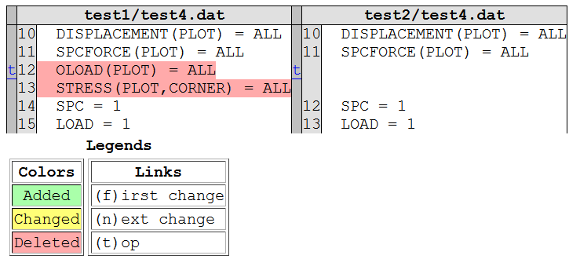
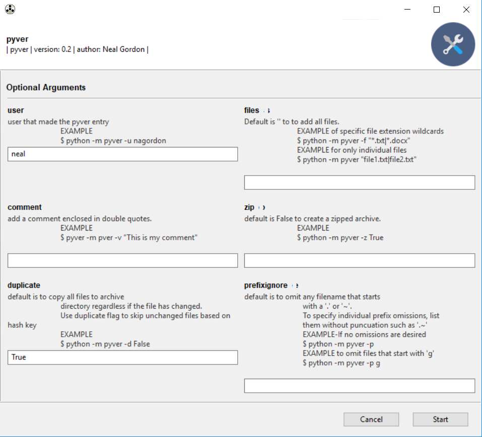

# pyver
Version control for dummies

https://github.com/nagordon/pyver

## TODO  
* [x] Append revision string (eg -00, -01, etc) on the end of an archive
* [x] Clean up file view in log, make new lines?
* [ ] File locking or read only attributing with [py-filelock](https://github.com/benediktschmitt/py-filelock) or [fasteners](https://github.com/harlowja/fasteners) or [portalocker](https://github.com/WoLpH/portalocker) or [Filelock](https://github.com/dmfrey/FileLock)
* [x] Create GUI - https://github.com/chriskiehl/Gooey
* [x] Package with [flit](http://flit.readthedocs.io/en/latest/index.html)
* [x] create file hash key
* [x] added file compare tool
* [x] added directory compare tool
* [x] added optional file character name prefixes to ignore

## Why pyver?  
The motivation behind pyver, which is to creating a version control method which is very, very simple to track the history of files. The work-flow of pyver is something I do anyway when working on something simple that uses binary files, especially ones that are linked through the software that is required to read them (eg CAD, Excel, etc). In the past I would create multiple version directories and copy the entire contents of my in-progress files in it that I want to preserve the history. The issue with this is that when file names are changed, it can break links to dependent files, so keeping a file identical is important for tracking files. It was also a goal to use this tool over a network drive where multiple users can archive files as they wish.  
There are many versioning tools, but usually have a steep learning curve and some do not perform well with large binary files. Also, most version control systems are designed for code or text files, not large binanry files, like word documents or cad files. If you need more functionality, I'd recommend checking out these programs in order os simplicity. [boar VCS](https://bitbucket.org/mats_ekberg/boar/wiki/Home), [mercurial SCM](https://www.mercurial-scm.org/), [git](https://git-scm.com/) with the [large file extension](https://git-lfs.github.com/)

## The basic operation of this program goes like this
1) create some files  
2) run pyver which makes a copy of your files  
3) rerun pyver to make as many revisions as you want  
4) if you want to revert back to an older revision, simply navigate to the dated .archive directory and grab the files and put them in your current directory  

### Criteria for design
* Simplicity is your friend, obscurity is your enemy
* It is unacceptable to rename files to track versions. Pyver accomplishes this by putting the files in different directories and keep your current file with the desired, persistent filename
* Can be used over a network drive. Does not require a central server.
* Be OS agnostic (written in Python)
* know when the changes were made, with a comment and who did it

# Tutorial

## Install
Pyver can be installed using the `setup.py` file. This will allow you to use the `-m` flag directly from the command line anywhere on your system and a custom bat file is not required.
```
python setup.py install
```

## Help  

To for basic operation the help flag shows the command line opertions
```bash
python -m pyver --help  
```  

```bash
usage: pyver.py [-h] [-u USER] [-f FILES] [-c COMMENT] [-z ZIP] [-d DUPLICATE]
                [-p PREFIXIGNORE]

| pyver | version: 0.2 | author: Neal Gordon |

optional arguments:
  -h, --help            show this help message and exit
  -u USER, --user USER  user that made the pyver entry
  -f FILES, --files FILES
                        Default is '' to to add all files. EXAMPLE of specific
                        file extension wildcards $ python -m pyver -f
                        "*.txt|*.docx" EXAMPLE for only individual files $
                        python -m pyver "file1.txt|file2.txt"
  -c COMMENT, --comment COMMENT
                        add a comment enclosed in double quotes. EXAMPLE $
                        pyver -m pver -v "This is my comment"
  -z ZIP, --zip ZIP     default is False to create a zipped archive. EXAMPLE
                        python -m pyver -z True
  -d DUPLICATE, --duplicate DUPLICATE
                        default is to copy all files to archive directory
                        regardless if the file has changed. Use duplicate flag
                        to skip unchanged files based on hash key EXAMPLE
                        python -m pyver -d False
  -p PREFIXIGNORE, --prefixignore PREFIXIGNORE
                        default is to omit any filename that starts with a '.'
                        or '~'. To specify individual prefix omissions, list
                        them without puncuation such as '.~' EXAMPLE-If no
                        omissions are desired python -m pyver -p EXAMPLE to
                        omit files that start with 'g' python -m pyver -p
```

if you need help or want to see the documentation, either reference the [README](https://github.com/nagordon/pyver/blob/master/README.md) or refer to the local docstring.

```bash
pydoc pyver
```

```bash
Help on module pyver:

NAME
    pyver - Version control for dummies

DESCRIPTION
    https://github.com/nagordon/pyver

FUNCTIONS
    add_path(add_folder='C:\\Users\\ngordon\\test')
        temporarily adds path to the system PATH variable

    all_files(rootDir='.', wildcard='.', prefixignore='.~')
        returns all files and directories that do not start with prefixignore
        accepts wildcards in the format *.py   or *.txt

    clearFiles(filetypes=['exe', 'spec'])
        WARNING THIS WILL DELETE FILES SO USE CAREFULLY
        clears the files

    clearFilesExcept(filetypes=['py', 'txt', 'docx', 'xlsx'])
        WARNING THIS WILL DELETE FILES SO USE CAREFULLY
        clears the files except filetypes

    create_md5_hex_hash(fname)
        return a md5 hash key for a individual file

    create_windows_shortcut(targetfile, targetfolder)
        IN WORK-NOT CURRENTLY USED
        generate a shorcut to a windows file    

        # add if running in a thread
        pythoncom.CoInitialize()

        targetfile = 'test1.xlsx'
        targetfolder = 'file_compare'

    dirdiff(dir1, dir2)
        Here is a simplified example of using the subdirs attribute to search
        recursively through two directories to show common different files:

        dir1 = 'test1'
        dir2 = 'test2'

    file_mtime(path)
        returns the file modified time

    filediff(fromfile, tofile)
        Command line interface to difflib.py providing diffs in four formats:

        html:     generates side by side comparison with change highlights.

    files_same(f1, f2)
        https://docs.python.org/3.6/library/filecmp.html   

        returns True if the files are the same

    find_modified_time(myfile)
        find when the file was last modified

    log()
        shows the contents of the pyver log file

    make_hidden(hidedir)
        creates windows hidden folder
        can also use the windows command
        os.system("attrib +s +h "+.archive)

    make_win_exe()
        creates a windows exe file that allows the pyver program to be
        run without the windows interpreter

    pyver(user, comment, archivefiles, ziparchive, duplicate)
        main function of pyver. copys files from the current directory and creates an archive.
        comma-delimmeted log file pyver.log keeps a record of the file changes

    show_file_info(filename)
        prints file info such as time created

    string_to_bool(string)
        returns a boolean type object given a string

    tree(path, indent=' ')
        recursiveley prints the contents of a directory

VERSION
    0.2

AUTHOR
    Neal Gordon

FILE
    c:\users\neal\desktop\pyver\pyver.py
```

## Run from the command line
To get started, lets do a quick demo in windows. Brace yourself, you are going to have to use the command line. In your current directory with the pyver.py file, open a command line with ```shift+right_click``` and in the menu select ```Open command window here```. Another way to get a command window in your current directory is to type ```alt+D``` and type ```powershell``` or ```cmd```.
Now type

```bash
python -m pyver.py
```

```bash
not currently a pyver repo, creating archive file directory .archive
.archive set to Hidden
----files archived----
.archive\00_20181126181536\test4.dat_test4.dat.html
.archive\00_20181126181536\test1\test1.dog
.archive\00_20181126181536\test1\test1.fish
.archive\00_20181126181536\test1\test1.txt
.archive\00_20181126181536\test1\test2.txt
.archive\00_20181126181536\test1\test3.dat
.archive\00_20181126181536\test1\test4.dat
.archive\00_20181126181536\test1\test7.xlsx
.archive\00_20181126181536\test2\test3.dat
.archive\00_20181126181536\test2\test4.dat
.archive\00_20181126181536\test2\test7.xlsx
.archive\00_20181126181536\test2\test8.txt
.archive\00_20181126181536\test2\test9.xlsx
```

If you prefer not running the setup.py, you can create a bat or exe file and add it to the system variables to run directly from the command line(see [Add pyver path to system](#Add-pyver-path-to-system)) and [Building a Windows EXE](#Building-a-Windows-EXE).

First, create a file named `pyver.bat` and type in the files
```bash
@python.exe %~dp0\pyver.py %*
```

The file pyver.bat is callable from windows without have to specify python
```bash
python pyver
```

Done. That's it. We have created a pyver repository and made a backup of all the files in our current directory in an archive naming year-month-day-hour-minute-second. Anytime we need to make another backup, just repeat the last step.

For more complicated uses, a common syntax could look this. Only one file, _test9.xlsx_ has been saved
```bash
python -m pyver -f "*.xlsx" -d False -c "updating my excel files only and only keeping files that change"
```

```bash
extension .html not found or skipping
extension .dog not found or skipping
extension .fish not found or skipping
extension .txt not found or skipping
extension .txt not found or skipping
extension .dat not found or skipping
extension .dat not found or skipping
.xlsx added .\test1\test7.xlsx
extension .dat not found or skipping
extension .dat not found or skipping
.xlsx added .\test2\test7.xlsx
extension .txt not found or skipping
.xlsx added .\test2\test9.xlsx
----files archived----
test1\test7.xlsx is an archived unchanged file, skipping new archive
test2\test7.xlsx is an archived unchanged file, skipping new archive
.archive\03_20181126182456\test2\test9.xlsx
```


## file tools

### directory diffs
```bash
$ python -m pyver dirdiff test1 test2
```

```bash
----comparing directory test1 and test2----
diff test1 test2
Only in test1 : ['.test1.txt', 'test1.dog', 'test1.fish', 'test1.txt', 'test2.txt', '~test.txt']
Only in test2 : ['test8.txt', 'test9.xlsx']
Identical files : ['test3.dat', 'test7.xlsx']
Differing files : ['test4.dat']
created html diff report for test4.dat
created test4.dat_test4.dat.html
```



## pyver log
```bash
python -m pyver log
```

```bash
User,      Timestamp,            Size,      Comment

neal,      00_20181126181536,    11 kb,

neal,      01_20181126181633,    11 kb,
```

##  pyver tree

```bash
python -m pyver tree
```

```bash
   ./.archive
    |  ./00_20181126181536
    |   |  ./test1
    |   |   |     test1.dog
    |   |   |     test1.fish
    |   |   |     test1.txt
    |   |   |     test2.txt
    |   |   |     test3.dat
    |   |   |     test4.dat
    |   |   |     test7.xlsx
    |   |  ./test2
    |   |   |     test3.dat
    |   |   |     test4.dat
    |   |   |     test7.xlsx
    |   |   |     test8.txt
    |   |   |     test9.xlsx
    |   |     test4.dat_test4.dat.html
    |  ./01_20181126181633
    |   |  ./test1
    |   |   |     test1.dog
    |   |   |     test1.fish
    |   |   |     test1.txt
    |   |   |     test2.txt
    |   |   |     test3.dat
    |   |   |     test4.dat
    |   |   |     test7.xlsx
    |   |  ./test2
    |   |   |     test3.dat
    |   |   |     test4.dat
    |   |   |     test7.xlsx
    |   |   |     test8.txt
    |   |   |     test9.xlsx
    |   |     test4.dat_test4.dat.html
    |     pyver.jsn
    |     pyver.log
   ./test1
    |     .test1.txt
    |     test1.dog
    |     test1.fish
    |     test1.txt
    |     test2.txt
    |     test3.dat
    |     test4.dat
    |     test7.xlsx
    |     ~test.txt
   ./test2
    |     test3.dat
    |     test4.dat
    |     test7.xlsx
    |     test8.txt
    |     test9.xlsx
      test4.dat_test4.dat.html
```


## backing up multiple directories
If there are multiple directories that need backed up, one easy way is to select the folders in windows explorer and paste them into a script(similar to this one) and then modify the `filelist` variable as shown

```python
import os

filelist = ["C:/Users/user1/test1", "C:/Users/user1/test2"]

for f in filelist:
    os.chdir(f)
    os.system('pyver -c "automated backup"')
    print('archived {}'.format(f))
print('complete')
```

## finish
There you have it. The worlds easiest version control system that multiple users can use over a network, retrieving your old files is trivial, and now you don't have to change your file names to all the silly things people come up with.


# sundries

## using the GUI
An graphical user interface has been included. To use the gui instead, uncomment the follow two lines of _pyver.py_

```python
from gooey import Gooey
@Gooey
```

and voila




## add pyver path to system
OK, lets add a bit more work upfront to save us some typing for years to come. I would recommend having a windows folder that is added to the user PATH system variable where you can keep test or production scripts that you want to access from the command line. For example, I have ```C:\Users\Neal\bin``` that is in the system PATH variable which I can dump python scripts with the *.bat file. Now, all we have to type is ```pyver``` to get the same result as ```python pyver.py```
To add this path variable, type

```
1) Start  
2) search "variables" and select "Edit Enviornmental variables for your account"
3) Add PATH variable or append with the path to the folder with your scripts  
```

## Building a Windows EXE
I used pyinstaller to build my own windows executable. Note that I have not successfully compiled the GUI version of the code.
```bash
pyinstaller pyver.py --onefile
```
